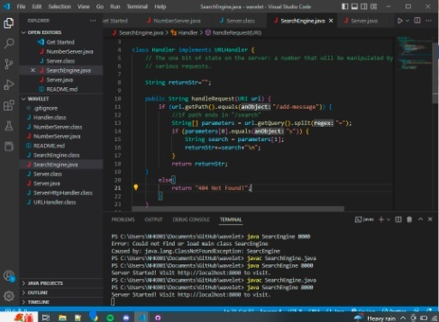
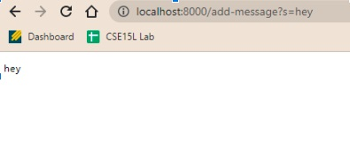
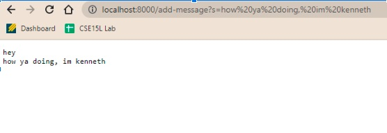
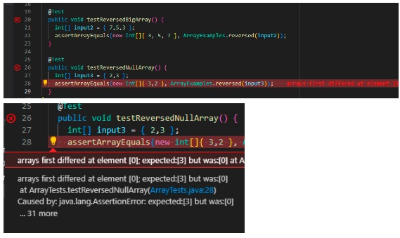
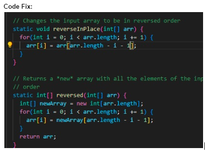
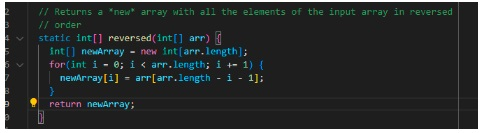
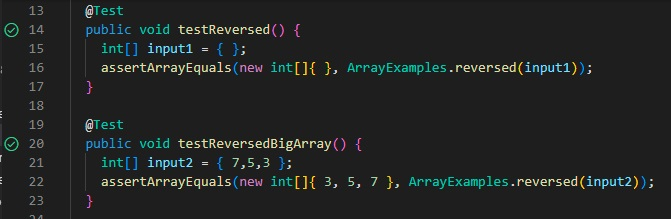

# Lab Report 2 by Kenneth Nguyen, PID A17458399#
## Table of Contents
1. Web Server "StringServer" implementation
2. A Bug from Lab 3
3. What Did I Not Know Before Lab 2 or 3?

## Part 1: String Server Implementation
In this part, we were tasked with creating a web server in Java that took URL queries.
* For example, if the URl ended in `/add-message?s=<insert string here>`, we would print out the (insert string here) part.
* If there were more strings subsequently, we would concatenate it to the current string and print out both the new and previous string(s) provided.
  
Below is a screenshot of the implementation:
  

* Begin by importing IOException and URI libraries.
* On line 8, we initialize our return string upon executing the program.
* On line 10, we define our function handleRequest(URI url)
* Inside this method, if our path begins with `/add-message`, then we will split the following queries by the equal sign and store the arguments in a String\[] array called parameters.  
* Then, we'll take the parameter at index 1 (after the  `'?s'` keyword) and concatenate that to our returnStr, then returnStr to end the method call.
* If there was an error, it will say `404 Not Found.`

Let's run our server:

> This is what our server says when we first put the query as "hey".
> 

> This is what our server says when we SUBSEQUENTLY put the query as "how ya doing, im kenneth".

*For any further queries that we put after our `s=` in the URL, it will concatenate it to our string and print a new line on our end.*

That concludes our simple String Server.

## Part 2: A Bug from Lab 3

Let's examine this bug in the `ArrayExamples.reversed()` method.

> **Symptom:** Clearly, the elements are not reversing right, and the symptom is that at element 0, we are getting 0 and not 3. Since the purpose of our function is to reverse the array, our function has some bad symptoms.

> **Bug:** It seems the bug is that we are overwriting the array before we can get the elements at the end, and we are referencing different values from the original when it comes to replacement.

Let's fix our code.

> Our old code.

In reversed(), the bug is that we are replacing the old array values with new, null values in newArray. Instead, we want to vice versa the process; replace the newArray values with all of the values of the old value, then return newArr as the copy of arr, which will replace it in the method call.

> Our new code.

> Our tests pass now, and this is because our indexing bug was fixed.

## Part 3: What I Learned from Lab 2

### I didn't know that you could run web servers with Java and read URLs.
In general, I didn't know a lot about how web servers worked. Lab 2 exposed me to how:
* You could run a local host server with thousands of available ports per computer.
* You could parse the URL path, and depending on the query, could return different values to be displayed by the server.
* You could access remote servers from other locations on the web, not only your local computer, the way I accessed my partner's remote server given his unique port. 
* That wen you access someone else's remote server, you can interact with the same variables

### From Lab 3, I got better at identifying symptoms, bugs, and fixes.
I learned that:
* Symptoms are the bad output that was received.
* Bugs are the behavior of the code that don't behave like how you intend.
* Debugging should be more planned and calculated than just changing variables and hoping it works, and that JUnit is a strong tool for identifying which unit tests you fail.

## The End.
### Lab Report 3 by Kenneth Nguyen, PID A17458399
